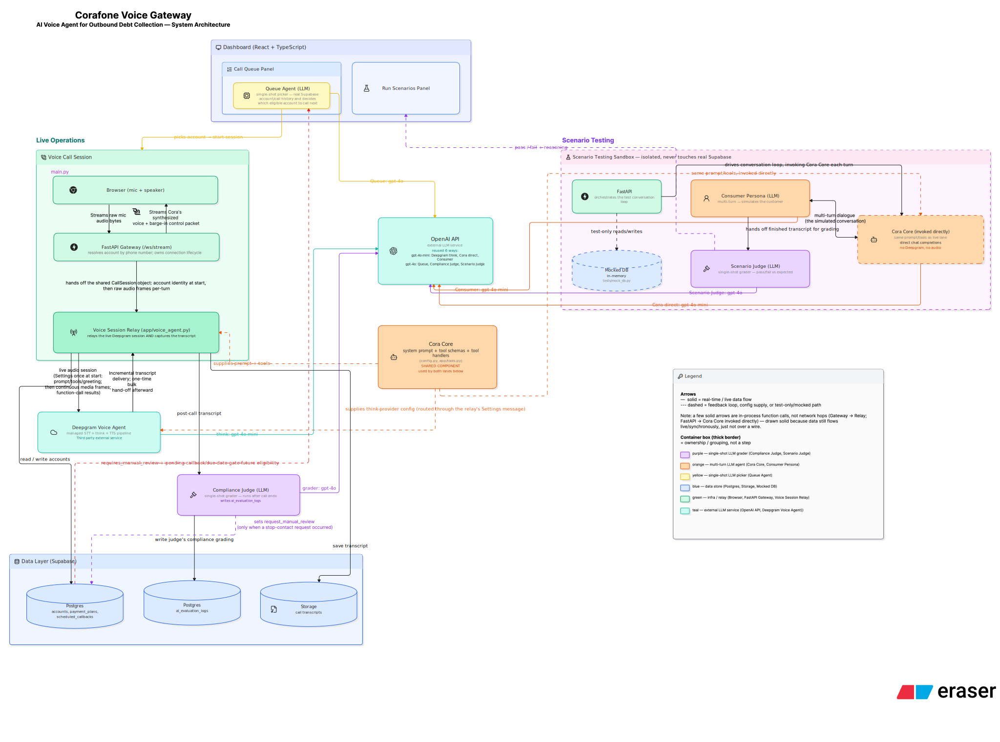
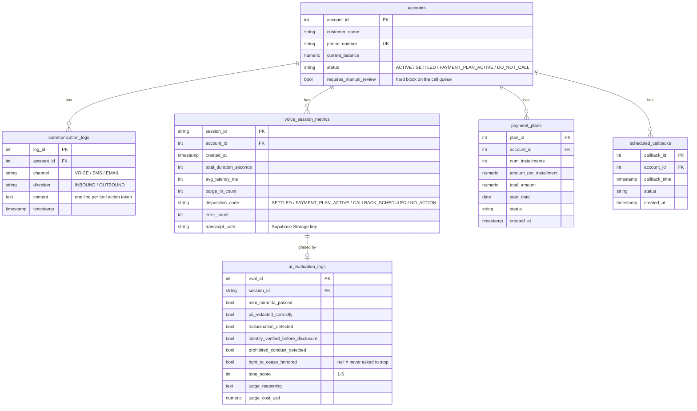

# Corafone Voice Gateway

An AI voice agent that makes outbound debt-collection calls — holds a real spoken conversation, offers a settlement or a payment plan, books callbacks, and grades its own compliance after every call. Built on FastAPI, Deepgram's Voice Agent API, and OpenAI, with a Supabase backend and a TypeScript dashboard for oversight.

## Features

- **Live voice conversation** — real-time mic-in/speech-out over a WebSocket, full barge-in support (interrupt the agent mid-sentence and it stops instantly).
- **Agentic actions, not just talk** — the agent can settle the balance in full, set up a 2-6 month installment plan, or schedule a callback, each backed by a real, idempotency-guarded database write.
- **Deterministic compliance gates** — a stop-contact request permanently blocks future auto-dialing (`requires_manual_review`), and accounts are never called before a promised callback or payment due date — both enforced in code, not left to an LLM's judgment.
- **Post-call compliance audit** — every transcript is graded by an LLM judge for the Mini-Miranda disclosure, identity verification, hallucinated terms, prohibited conduct, and tone.
- **Agentic call queue** — a separate LLM decides which eligible account to call next from real account/call history, with its reasoning shown before you place the call.
- **Scenario test suite** — seven adversarial conversation scenarios (happy path, vague agreement, wrong person, stop-contact request, etc.), run against the real prompt and tools with a mocked DB, graded by structural checks and an LLM judge. Runnable from the dashboard or CI.
- **Dashboard** — account status, compliance rollup, call history with full transcripts, active payment plans/callbacks, the agentic queue, and a live scenario-test runner.

## Architecture

<!-- Export the diagram from Excalidraw/Eraser and save it as docs/diagrams/architecture.png (or .svg) -- this embed will pick it up automatically. -->


**Five separate AI decision-makers**, each with a different job and a different amount of autonomy:

| Component | File | Model | Nature |
|---|---|---|---|
| Cora | `app/voice_agent.py` + `config.py` | gpt-4o-mini | Multi-turn conversational agent, live on the call |
| Queue Agent | `app/queue_agent.py` | gpt-4o | Single-shot: picks which eligible account to call next |
| Compliance Judge | `app/audit.py` | gpt-4o | Single-shot: grades the finished call transcript |
| Scenario Judge | `tests/scenarios/judge.py` | gpt-4o | Single-shot: grades a test scenario's transcript against its expected outcome |
| Consumer Persona | `tests/scenarios/harness.py` | gpt-4o-mini | Multi-turn, test-only: simulates the customer in scenario tests |

**Two lanes share one "Cora Core"** — the system prompt, tool schemas, and tool-handling logic (`config.py` + `app/tools.py`) are a single shared component invoked two different ways:
- **Live calls**: Browser → FastAPI Gateway (`/ws/stream`) → Voice Session Relay → Deepgram Voice Agent (which owns STT, the OpenAI "think" call, and TTS) → back to the browser. The relay captures the transcript turn-by-turn as it happens and, on hangup, uploads it to Supabase Storage and hands it to the Compliance Judge.
- **Scenario tests**: a FastAPI endpoint drives a full text conversation directly over OpenAI's chat completions API — no Deepgram, no audio — between the Consumer Persona and Cora Core, against a mocked DB, then hands the transcript to the Scenario Judge.

**The compliance feedback loop**: whenever the Compliance Judge detects a stop-contact request on a call, it sets `accounts.requires_manual_review = TRUE`. The call queue's eligibility check reads that flag before ever asking the Queue Agent's LLM to consider the account — a past compliance event permanently and deterministically removes an account from future auto-dialing.

## Data model



The full-conversation transcript itself lives outside Postgres, as a text file in Supabase Storage (`communications/{account_id}/{call_timestamp}/log.txt`) — `voice_session_metrics.transcript_path` points to it. `communication_logs` holds only one structured line per tool action (settlement charged, callback booked, etc.), not the full dialogue.

## Tech stack

- **Backend**: Python, FastAPI, WebSockets, `asyncpg`
- **Voice**: Deepgram Voice Agent API (STT + turn-taking/barge-in + TTS), `flux-general-en` STT model, `aura-2-harmonia-en` TTS voice
- **LLM**: OpenAI (`gpt-4o-mini` for the live conversation, `gpt-4o` for every judge/picker role)
- **Data**: Supabase (Postgres + Storage)
- **Dashboard**: Vite, React 19, TypeScript, Tailwind CSS
- **Testing**: pytest + pytest-asyncio (Layer 1, fully mocked), a custom LLM-scenario harness (Layer 3)

## Setup

**Backend**

```bash
python3 -m venv venv
source venv/bin/activate
pip install fastapi uvicorn websockets asyncpg httpx openai pydantic python-dotenv deepgram-sdk
```

Create a `.env` in the project root:

```text
OPENAI_API_KEY=your_openai_api_key
DATABASE_URL=your_supabase_session_pooler_connection_string
DEEPGRAM_API_KEY=your_deepgram_key
SUPABASE_URL=your_supabase_project_base_url
SUPABASE_SERVICE_ROLE_KEY=your_supabase_service_role_key
```

Start the gateway:

```bash
uvicorn app.main:app --reload
```

**Dashboard**

```bash
cd dashboard
npm install
npm run dev   # http://localhost:5173, expects the backend on http://127.0.0.1:8000
```

**Voice demo client** (standalone, outside the dashboard)

```bash
cd frontend
python3 -m http.server 8080
```
Open `http://127.0.0.1:8080/index.html` — requires mic permissions, so serve over `http://`, not `file://`.

**Tests**

```bash
pip install pytest pytest-asyncio
pytest                              # Layer 1: unit tests, fully mocked, free and instant
pytest -m scenario                  # Layer 3: LLM scenario suite -- costs real OpenAI tokens
```

## Project structure

```
app/
  main.py           FastAPI app + /ws/stream WebSocket route (browser-facing)
  voice_agent.py     Deepgram Voice Agent session, transcript capture, teardown
  config.py          Cora's system prompt, tool schemas, greeting -- the shared "Cora Core"
  tools.py           Settlement / payment plan / callback tool handlers, idempotency guards
  db.py              Supabase Postgres access (asyncpg)
  storage.py         Supabase Storage access (transcripts)
  audit.py           Post-call compliance judge
  queue_agent.py     Agentic call-queue picker
  dashboard_api.py   Read-only dashboard API + live scenario-test runner
  session.py         Per-call state (CallSession)
  database/          Schema, migrations, seed data + seed transcripts
dashboard/            Vite + React + TypeScript dashboard
frontend/              Standalone vanilla-JS voice demo client
tests/
  test_*.py           Layer 1 unit tests (mocked DB/LLM/Deepgram)
  scenarios/          Layer 3: LLM-driven conversation scenarios + judge
.github/workflows/     CI (Layer 1 on every push; Layer 3 manual, workflow_dispatch)
```

## Compliance notes

- **Mini-Miranda disclosure** is a fixed, verbatim line stated on the first turn once identity is confirmed — never left to the LLM to paraphrase.
- **Identity verification precedes any debt disclosure** — if the person on the line isn't confirmed to be the account holder, Cora will not reveal the balance, the debt, or even that this is a collections call.
- **Stop-contact requests are a hard stop**: honored immediately, mid-conversation, regardless of what else was being discussed — and permanently block that account from the automated call queue afterward (`requires_manual_review`), independent of what the LLM itself decided in the moment.
- **No unauthorized terms**: settlement is full-balance-only (no discount authority), and payment plans are capped at 2-6 monthly installments — anything else is flagged by the compliance judge as a hallucination.
- **Account state changes never trust the LLM's own account_id** — it's resolved server-side from the phone number at call start and never exposed as a tool parameter.

## Known limitations

- FDCPA's call-frequency-limit rule (contact attempts per debtor per week) isn't enforced — it needs cross-call aggregation over `communication_logs`, not a per-call judge.
- The live conversation's OpenAI token cost isn't measurable — Deepgram intermediates those calls, so only judge/picker LLM costs (`judge_cost_usd`) are tracked precisely.
- The Scenario Judge only sees transcript text, not which tools actually fired — tool-call-count claims are covered by separate structural checks, not the judge itself.
- No real telephony — calls happen over a browser WebSocket (mic + speaker), not a PSTN/SIP trunk.
